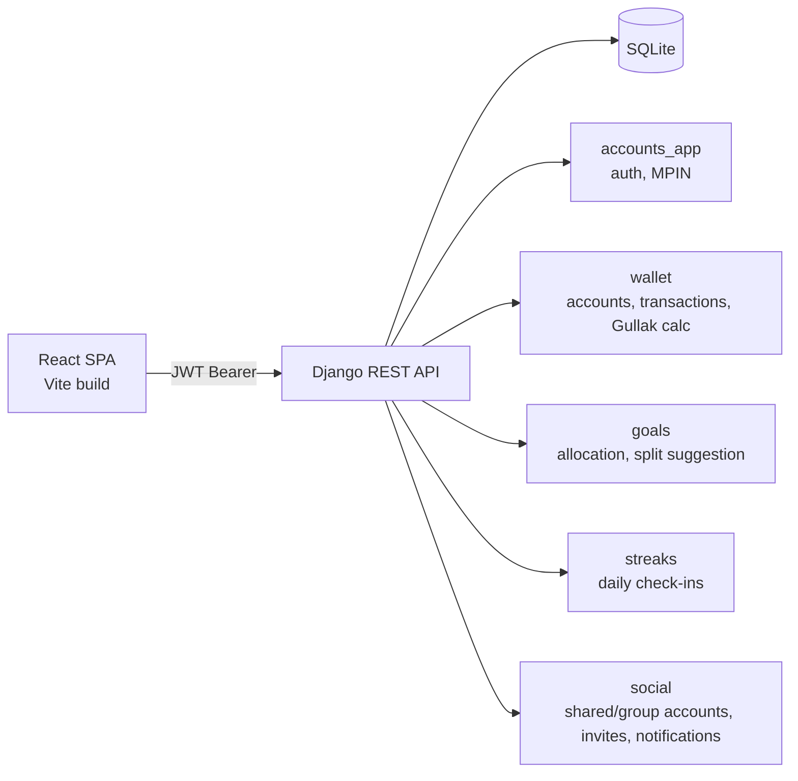
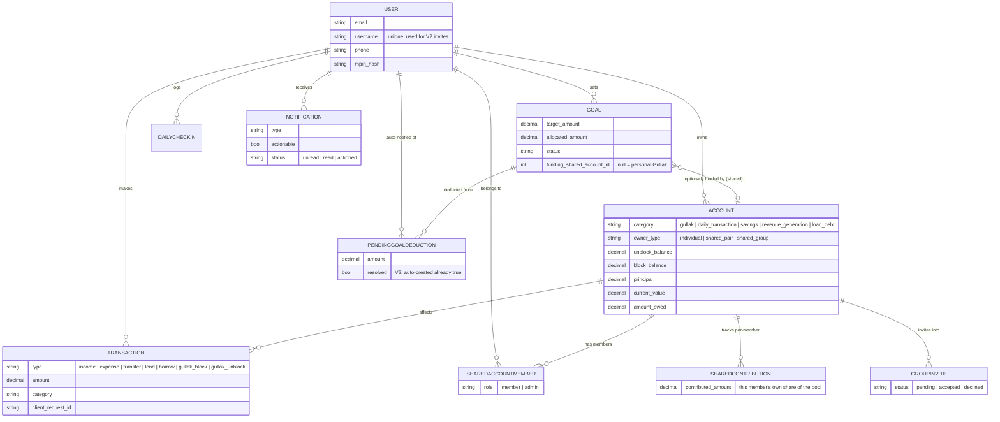

# Gullak V2

A personal **and shared** money-management app: track daily spending, block money into your Gullak (savings), set goals, build a daily check-in streak, and now save together — with a partner in a shared account, or with family and friends in a group — all money handled as exact decimal rupees (no float rounding bugs).

## Table of contents

- [Features](#features)
- [What's new in V2](#whats-new-in-v2)
- [Technology stack](#technology-stack)
- [Architecture](#architecture)
- [Windows setup](#windows-setup)
- [Manual setup](#manual-setup)
- [Running the app](#running-the-app)
- [Folder structure](#folder-structure)
- [Main Django apps](#main-django-apps)
- [Authentication & roles](#authentication--roles)
- [CSV export](#csv-export)
- [Dashboard analytics](#dashboard-analytics)
- [Demo accounts](#demo-accounts)
- [Usage guide](#usage-guide)
- [Shared & group accounts guide](#shared--group-accounts-guide)
- [Split groups (`splits` app) guide](#split-groups-splits-app-guide)
- [Testing](#testing)
- [Database backup & restore](#database-backup--restore)
- [Deployment (free, Render.com)](#deployment-free-rendercom)
- [Troubleshooting](#troubleshooting)
- [Completed features checklist](#completed-features-checklist)
- [Future improvements](#future-improvements)

---

## Features

- **4 spendable account categories**: Daily Transaction, Savings, Revenue Generation, Loan/Debt — each with its own relevant fields
- **Gullak is a real account**: appears in your Accounts list with its own detail page, running total, and full block/unblock history — not just a computed number
- **Block / Unblock**: move money from any Daily Transaction/Savings account into Gullak, with a deliberate friction screen for emergency unblocks
- **Transactions**: income, expense, lend, borrow, transfer — with category tagging and notes. Gullak block/unblock movements are recorded separately and only show on the Gullak account's own page, not the general Transactions list
- **CSV export**: download your transactions as a CSV (respects whatever type filter is active on the Transactions page)
- **Double-submit protection**: every transaction, block, and unblock carries a client-generated idempotency key
- **Goals**: add funds to a named goal from your Gullak (one-way — you can only add, never directly edit the allocated total down); over-allocation across goals is blocked server-side
- **Emergency-unblock overage handling**: if an emergency unblock draws on money already allocated to a goal (not just the unallocated pool), you're asked on your next Home visit which goal(s) to deduct it from — nothing is silently reassigned
- **Streaks**: a timezone-safe daily check-in counter (client sends its own local date, so travel/timezone changes don't corrupt the streak)
- **MPIN quick-unlock**: 4–6 digit PIN required every time the app is opened or reloaded (if set) — a faster alternative to re-typing your password each time, without weakening the underlying JWT session
- **Password reset**: real emailed reset link (SMTP if configured, otherwise Django's console backend for local dev — see below), single-use token, 1-hour expiry
- **Analytics**: Net Worth Over Time and Spend by Category charts on the dashboard

## What's new in V2

- **Public landing page** at `/` — explains the app's features with Login/Register CTAs. Already-signed-in users skip straight to `/unlock` (if they have an MPIN) or `/home`.
- **Shared (Relationship) accounts** — a simple 2-person pooled savings account, no admin: both partners are equal.
- **Family & Friends group accounts** — pool money with 2 or more people for a trip, gift, or event, with an admin who manages membership (consent-based transfer, no forced handoff).
- **Username-based invites** — invite by username (not phone/email), and the invite must be explicitly accepted before anyone gains access. No one can add another user without their approval.
- **Aggregate-only visibility** — in a shared/group account you always see *your own* contribution in full; everyone else's is only ever shown as one combined total, enforced server-side (not just hidden in the UI).
- **Unblock only your own share** — a member can emergency-unblock only the portion they personally contributed, never the pooled total or another member's share.
- **No cross-funding** — a goal is either funded from your personal Gullak, or from one shared account, never both.
- **Automatic emergency-unblock deduction** — if an emergency unblock eats into goal-allocated funds, the shortfall is now deducted automatically and proportionally across your underfunded goals (previously required manual resolution), with an informational notification explaining what happened.
- **Smart Gullak-split suggestion** — when adding a new lump sum, get a suggested split across your underfunded goals based on urgency (`(target − allocated) / days left`), capped at your live unallocated Gullak, fully editable before you apply it. Optionally include common goals from a shared account you're part of — each capped against that account's own unallocated pool, never mixed with your personal Gullak.
- **Per-goal contribution tracking** — a common goal now tracks who funded how much of it, surfaced via a dedicated goal-progress page showing your own contribution in full and everyone else's as one combined total (same aggregate-only rule as the shared account itself).
- **Global page header** — every screen has a consistent header: back arrow (top-left), page title, and a notification bell with unread badge (top-right).
- **Notification Center** — invites, admin-transfer requests, member joined/left, admin changed, and goal-deduction notices all land in one place, reached via the header's bell icon (refreshed on navigation).
- **Group Expense Split & UPI Settlement** — inside a Family & Friends group account, log a shared expense (e.g. a dinner or cab), split it equally or by exact custom amounts among selected members, and generate the minimal set of "who owes whom" settlements. The payer opens a pre-filled UPI deep-link to the payee's self-reported UPI ID; the payee manually confirms once they've actually received it — no real money moves through the app.
- **Standalone Split Groups** — a separate, Splitwise-style splitting tool (`splits` app) independent of wallet accounts: create a group with anyone directly (no invite/accept step), split equal/custom/percentage, choose fewest-payments or detailed settlement mode, and pay via the same UPI-link/QR approach, with a full six-screen UI (`features/splits/`).

## Technology stack

**Backend**
- Django 5.1 (LTS-adjacent) + Django REST Framework
- SQLite
- SimpleJWT (access/refresh tokens, blacklist-on-rotate)
- Argon2 password hashing
- django-cors-headers, django-filter
- whitenoise + gunicorn (production static files / WSGI server)
- Requires **Python 3.11 or newer**

**Frontend**
- React 19 + Vite
- React Router
- Axios (with automatic JWT refresh on 401)
- `qrcode` — client-side QR code generation for UPI payment links (splits feature only, dynamically imported)
- Plain CSS with a small design-token system (no framework) — Sora + Inter fonts

## Architecture





**Why a separate `social` app instead of folding this into `wallet`?** Shared/group account logic (membership, invites, visibility rules, admin transfer) is a distinct concern from individual account math, and V1 already reserved `Account.owner_type` for this — keeping it a separate app matches that intent and keeps `wallet` focused on the core ledger.

**Why a separate API + SPA instead of server-rendered templates?** This was a deliberate choice for V1 so the same DRF API can later serve a mobile app without rework.

**Why exact Decimal rupees instead of float?** Python/Django `Decimal` fields do exact base-10 arithmetic — no float rounding drift, even across many small transactions. Every money field on every model is a `DecimalField(max_digits=12, decimal_places=2)`; the API accepts and returns decimal strings (e.g. `"1234.50"`), and the frontend never converts to/from a different unit — what you type in rupees is exactly what's stored and returned.

**Why is Gullak a real Account instead of a computed total?** So it has its own place in the Accounts list, its own detail page, and its own transaction history (the block/unblock legs), instead of being an abstract number computed from other accounts' fields. Every user gets exactly one Gullak account, created automatically the moment their account is created — it can't be created manually or deleted.

## Windows setup

1. Install [Python 3.11 or newer](https://www.python.org/downloads/) and [Node.js 20+](https://nodejs.org/) first, and make sure both are on your PATH (check "Add to PATH" during install).
2. Double-click `setup.bat` — creates the backend virtual environment, installs dependencies, runs migrations, and loads demo data.
3. Double-click `setup-frontend.bat` — installs frontend dependencies.
4. Double-click `run.bat` to start the backend (keep the window open).
5. Double-click `run-frontend.bat` in a **second** window to start the frontend.
6. Open **http://127.0.0.1:5173** in your browser.

## Manual setup

### Backend (Command Prompt / PowerShell)

```bat
cd backend
python -m venv venv
venv\Scripts\activate
pip install -r requirements.txt
python manage.py migrate
python manage.py seed_demo_data
python manage.py runserver 127.0.0.1:8000
```

### Frontend (separate terminal)

```bat
cd frontend
npm install
npm run dev
```

Frontend runs at **http://127.0.0.1:5173**, backend API at **http://127.0.0.1:8000/api**.

The frontend reads its API URL from `frontend/.env` (`VITE_API_BASE_URL`). It's pre-set to the local backend — no changes needed for local use.

## Running the app

Once both servers are running:
1. Go to http://127.0.0.1:5173
2. Log in with the demo account below, or register a new one
3. If registering fresh, you'll be prompted to set an MPIN (or skip it)

## Folder structure

```
gullak/
├── backend/
│   ├── config/            # Django project settings, root URLs, error handlers
│   ├── accounts_app/      # Custom User model, auth, MPIN, password reset, username lookup
│   ├── wallet/            # Account, Transaction models + business logic (services.py)
│   ├── goals/             # Goal model + allocation logic, split suggestion, auto-deduction
│   ├── streaks/           # DailyCheckIn model + streak computation
│   ├── social/            # V2: shared/group accounts, invites, admin transfer, notifications
│   ├── expenses/          # V2: group expense split (equal/exact) + UPI settlement generation
│   ├── splits/             # V2.3: standalone Split Groups app — services/ is a package, not a
│   │   │                   #   single file: settlement.py owns all settlement mathematics
│   │   │                   #   (split-type share rounding, pairwise netting, global
│   │   │                   #   simplification, "show calculation" explainability); groups.py,
│   │   │                   #   expenses.py, upi.py handle the rest
│   ├── manage.py
│   └── requirements.txt
├── frontend/
│   ├── src/
│   │   ├── api/           # Axios client + typed endpoint functions
│   │   ├── context/       # AuthContext (JWT + MPIN lock state)
│   │   ├── components/    # Shared UI primitives, layout, nav (with notification badge)
│   │   ├── pages/          # One file per screen — includes LandingPage (public "/"),
│   │   │                   #   NotificationsPage, SharedAccountsPage, CreateSharedAccountPage,
│   │   │                   #   SharedAccountDetailPage, SplitSuggestionPage (V2),
│   │   │                   #   GroupExpensesPage, SettlementsPage (V2)
│   │   ├── features/splits/ # V2.3: standalone Split Groups UI (6 screens, one folder each) —
│   │   │                   #   SplitGroups, CreateGroup, GroupDetail, AddExpense, Settlement,
│   │   │                   #   SplitSettings — plus shared/ (QrCode, client-side split-math preview)
│   │   └── utils/          # Money (decimal rupee) helpers, idempotency keys
│   └── package.json
├── postman/
│   └── Gullak_API_V2.postman_collection.json
├── setup.bat / run.bat                   # Backend
├── setup-frontend.bat / run-frontend.bat # Frontend
└── render.yaml                           # Free-tier deployment blueprint
```

## Main Django apps

| App | Purpose | Key models |
|---|---|---|
| `accounts_app` | Custom user (email or phone login), MPIN, password reset, username lookup for invites | `User` |
| `wallet` | Accounts (Gullak + 4 spendable categories + shared/group), transactions, Gullak total | `Account`, `Transaction` |
| `goals` | Savings goals (personal or shared-account-funded); split suggestion; auto-deduction | `Goal`, `PendingGoalDeduction` |
| `streaks` | Daily check-in tracking | `DailyCheckIn` |
| `social` | Shared/group accounts, membership, invites, admin transfer, notifications | `SharedAccountMember`, `GroupInvite`, `GroupOccasion`, `AdminTransferRequest`, `Notification`, `SharedContribution` |
| `expenses` | Group expense split (debt ledger, separate from pooled balance) + UPI settlement generation | `ExpenseEntry`, `ExpenseShare`, `Settlement` |
| `splits` | Standalone Splitwise-style group splitting — not tied to a wallet account. Own membership, GLOBAL/PAIRWISE settlement modes, equal/custom/percentage splits. Settlement mathematics lives in its own `services/settlement.py` module (pairwise netting, global simplification, rounding, "show calculation" explainability) | `SplitGroup`, `SplitGroupMember`, `SplitExpense`, `SplitExpenseShare`, `Settlement` |

Business rules (blocking over-allocation, block/unblock, transfers, double-submit protection, overage detection, invite/visibility/admin rules) live in each app's `services.py`, kept separate from views so the logic is reusable and independently testable.

## Authentication & roles

Each user only sees their own data and their own shared/group accounts. Within a shared/group account, V2 adds two lightweight roles:

- **Member** — every participant in a Relationship (pair) or Family & Friends (group) account.
- **Admin** — group accounts only (a pair account has no admin — two equal partners). The creator is admin by default; promotion to a new admin requires the target member's explicit acceptance (never a unilateral handoff).

Django's built-in admin site (`/admin/`) is available for the project owner to inspect data; create a superuser with:

```bat
python manage.py createsuperuser
```

Every user — including ones created via `createsuperuser` — automatically gets exactly one Gullak account via a `post_save` signal.

**Auth flow**: JWT access token (30 min) + refresh token (7 days, rotated and blacklisted on use). The frontend automatically refreshes an expired access token using the refresh token; if that also fails, the user is returned to login.

**MPIN**: separate from the account password. Set during onboarding or later from Profile. Required every time the app is opened or reloaded (if set) — it does not replace the JWT session; the access/refresh tokens stay valid, MPIN just gates the UI on each fresh load. The public landing page (`/`) automatically redirects an already-logged-in visitor straight to `/unlock` (if they have an MPIN) or `/home`.

**Username**: unique per account (Django's default `AbstractUser` uniqueness), used only for V2's invite-by-username flow — never for login, never shown beyond a member's own group.

**Password reset**: `POST /api/auth/password/reset/` sends an email containing a tokenized link to the frontend's `/reset-password` page (never returns the token in the API response — that would let anyone reset any account's password without ever receiving the email). The response is identical whether or not the email exists, and identical whether or not the send actually succeeded, so the endpoint can't be used to enumerate accounts or probe for mail-server outages. Which backend actually sends it depends on `EMAIL_HOST_USER`:
- **Not set** (default): Django's console backend — the email is printed to the backend server's log instead of actually sent. Fine for local dev: run `python manage.py runserver`, request a reset, and copy the link out of the terminal.
- **Set**, along with `EMAIL_HOST_PASSWORD`: real SMTP, using `EMAIL_HOST`/`EMAIL_PORT`/`EMAIL_USE_TLS` (see `.env.example` for Gmail App Password setup, or swap in any SMTP provider).

The link itself is built from `FRONTEND_URL` + `/reset-password?uid=...&token=...`, valid for `PASSWORD_RESET_TIMEOUT` seconds (default 3600 = 1 hour) and single-use — Django's built-in token generator bakes the current password hash into what it checks, so a token is invalidated the moment the password actually changes. Both the plain-text and HTML email bodies live in `accounts_app/templates/accounts_app/emails/`.

## CSV export

`GET /api/wallet/transactions/export/` downloads the requesting user's transactions as a CSV — columns `Date, Type, Category, Amount, Account, Description`. Honors the same filters as the transaction list (`?type=`, `?account=`, `?category=`, `?settled=`, `?include_gullak=`), so exporting matches whatever's currently shown on the Transactions page — the "Export CSV" button there passes through the active type filter automatically. Gullak block/unblock legs are excluded by default, same as the on-screen list.

## Dashboard analytics

Two read-only aggregation endpoints, both in the existing `wallet` app (no new Django app):

- **`GET /api/wallet/analytics/net-worth-history/?days=30`** → `[{"date": "...", "net_worth": "..."}, ...]`, oldest first. Daily Transaction / Savings / Gullak balances are reconstructed *exactly* by taking today's net worth and reversing each day's income/expense/lend/borrow transactions back off it (transfers and Gullak block/unblock move money between the user's own accounts, so they net to zero across the total and don't need reversing). Revenue Generation (`current_value`) and Loan/Debt (`amount_owed`) accounts have no dated transaction history in this app — they're direct fields, not built from a ledger — so their *current* value is held constant across every day in the range. This is a documented approximation, not a claim those balances were literally unchanged historically.
- **`GET /api/wallet/analytics/spend-by-category/?days=30`** → `[{"category": "Food", "amount": "..."}, ...]`, largest first, `EXPENSE`-type transactions only, categories with no spending in the period omitted.

Both accept `?days=` (clamped to 1–365, default 30). The frontend renders these as an area chart and a horizontal bar chart on the dashboard (`NetWorthChart.jsx` / `SpendByCategoryChart.jsx`, using `recharts`, lazy-loaded so the charting library ships as its own bundle chunk rather than bloating every page's initial load).

**Demo data note**: `Transaction.timestamp` uses `auto_now_add`, so it can't be backdated through the normal create flow (by design). The demo-data seed command backdates its transactions via a `QuerySet.update()` call after creation (which bypasses `auto_now_add` since it doesn't go through `Model.save()`) purely so these two charts have a realistic multi-day shape out of the box — this only affects the seed script, not the Transaction model or the real transaction-creation flow.

## Demo accounts

| Email | Username | Password | MPIN |
|---|---|---|---|
| demo@gullak.app | demo_student | Demo@12345 | 1234 |
| demo2@gullak.app | demo_friend | Demo@12345 | 1234 |

Loaded automatically by `python manage.py seed_demo_data` (add `--reset` to recreate it). The first user gets a Gullak account with funds already blocked in, 4 other accounts across the remaining categories, ~2 weeks of realistic transaction history, 2 personal goals with funds added, and a streak in progress. **Both users** are also set up in a shared group account ("Goa Trip Squad") with an already-accepted invite, contributions from each side, and a common goal funded from that shared pool — log in as either to see the V2 flow already in motion.

**⚠️ Change or remove demo credentials before any production/public deployment.**

## Usage guide

- **Home** — live Gullak total, net worth, unallocated amount, streak, daily check-in prompt, recent activity ("View all" opens the full Transactions history).
- **Accounts** — Gullak appears as its own card at the top, with a dedicated detail page (its running total and full block/unblock history). Below it, your other accounts are grouped by category; switch between Grid and horizontal-Scroll layouts with the toggle at the top (your choice is remembered). Tap into any account to block funds into Gullak, request an emergency unblock, or view its history.
- **Add** (center nav button) — log income, expense, lend, borrow, or a transfer between your own non-Gullak accounts. The form shows the selected account's live available balance. If an expense, lend, or transfer would exceed it, you'll see an "Insufficient balance" alert with a one-tap option to unblock just enough from Gullak and continue.
- **Transactions** (via Home → "View all") — full transaction history, filterable by type (income/expense/lend/borrow/transfer). Gullak block/unblock movements are intentionally excluded here — see them on the Gullak account's own page instead.
- **Goals** — a hero card shows your Gullak total, how much is allocated, and how much is unallocated at a glance. Create a goal, then **add funds** to it from your unallocated Gullak (a one-way action — you can't directly edit a goal's allocated total down; it only decreases via an automatic emergency-unblock deduction, or if you delete the goal). Use **Smart split** to get a suggested split of a new amount across your underfunded goals — the amount is capped at what's actually unallocated, and if you're part of a shared account you'll be asked whether to also include its common goals (capped separately against that account's own pool). A common goal shows a "Shared →" badge linking to its own progress page.
- **Shared** (side rail / bottom nav) — your Relationship and group accounts; create a new one, contribute, unblock your own share, invite, manage members, or transfer admin. Any common goals funded from that account are listed right on its detail page, each linking to a progress view (target/allocated/remaining, plus your own contribution vs. everyone else's combined — never a per-member breakdown).
- **Notifications** — reached via the bell icon in the header (top-right on every page): invites, admin-transfer requests, member changes, and goal-deduction notices. Opening the page marks visible items as read; actionable items (invites, admin transfers) stay visibly pending until you respond.
- Every screen has a consistent header: a back arrow (top-left, on every page except Home/Accounts/Goals/Profile) and the notification bell with an unread badge (top-right).
- **Profile** — update phone, add a UPI ID (used to build your "Pay via UPI" settlement link), change password, update MPIN, log out

**Block vs. Unblock vs. Emergency unblock**: "Block" moves money from a spendable account into your Gullak. Emergency unblock reverses that, moving money from Gullak back to a spendable account — it's always allowed if Gullak has the funds, but the UI adds a confirmation step to make you pause first. If the amount you unblock is more than what's currently unallocated (i.e. it eats into money you'd already committed to a goal), the shortfall is now deducted **automatically and proportionally** from your underfunded personal goals, and you'll see a notification explaining exactly what was adjusted.

## Shared & group accounts guide

- **Relationship account** — exactly 2 people, no admin. Either partner can invite the other (by username), contribute, or unblock their own share.
- **Family & Friends group account** — 2 or more people, with an admin (the creator, by default) who can invite, remove members, and initiate an admin-role transfer. A promotion only takes effect once the target member explicitly accepts it.
- **Contributing**: money moves from one of your own spendable accounts into the shared account's pooled balance. Your running contribution is tracked so it can later be unblocked by you specifically.
- **Visibility rule**: you always see your own contribution in full. Every other member's contribution is shown only as one combined total — this is enforced by the API itself, not just hidden in the UI, so it holds regardless of client.
- **Emergency unblock on a shared account**: capped at your own contributed amount. You can never unblock the pooled total or another member's share, and no one else's approval is needed for your own portion.
- **Leaving or being removed**: your already-contributed amount stays part of the group's pooled total — it isn't refunded or subtracted out. A group admin can't leave without transferring the role first.
- **Common goals**: a goal can be funded from a shared account instead of your personal Gullak (set at creation) — never both. Progress works the same way, just capped against the shared pool instead of your own Gullak.

## Group expenses & settlements guide

Available only on **Family & Friends group accounts** (not Relationship/pair accounts), from the "Group expenses & settlements" button on the account's detail page.

- **This is a separate debt ledger** — logging an expense never touches the group's pooled `block_balance` or anyone's `contributed_amount`. It only tracks who paid for what and who owes whom, exactly like a standalone expense-splitting tool. If you want the pooled savings to actually cover a purchase, use **Contribute**/spend from the account balance separately — the two features are intentionally independent.
- **Logging an expense**: pick who paid, the amount, a category, which members are splitting it, and how:
  - **Split equally** — divided evenly across selected participants; any leftover paisa from rounding is distributed one cent at a time (deterministic order) so shares always sum exactly to the total.
  - **Exact amounts** — enter each participant's share directly; the form blocks submission until they add up to the total.
- **Settlements**: tap "Recalculate settlements" to turn all logged expenses into the minimum number of payer→payee transfers needed to net everyone out (a standard greedy debt-simplification — it minimizes transaction count, not necessarily pairing people with who they specifically owed). Safe to re-run any time; already-confirmed (paid) settlements are kept as history and excluded from the recalculation.
- **Paying**: if you owe money and the payee has added a UPI ID to their Profile, a "Pay via UPI" button opens a pre-filled UPI deep-link (`upi://pay?...`) in their UPI app. No payment gateway is involved — the app never moves real money.
- **Confirming payment**: only the person who was owed money can mark a settlement "Paid" (self-reported, after they've actually received it via UPI/cash/etc.).
- **Deleting an expense**: only the original payer or whoever logged it can delete it.

## Split groups (`splits` app) guide

A standalone, Splitwise-style splitting tool — independent of wallet accounts, the `expenses` app's group-account debt ledger, and the `social` app. Any user can create a split group with any other users, with no wallet account or admin-approved invite required. Mounted at `/api/splits/`.

### Settlement mathematics (`splits/services/settlement.py`)

All settlement math lives in one dedicated module, kept separate from group/expense/UPI logic so it can be tested and reasoned about on its own:

- **Split-type share rounding** (`equal_shares`, `custom_shares`, `percentage_shares`) — one consistent rule everywhere: compute each person's floor-rounded share in whole paise, then hand out the leftover paise one at a time, in ascending user-id order. Shares always sum exactly to the original amount, however badly it divides (`equal_shares(₹100, 3 people)` → ₹33.34/₹33.33/₹33.33, not ₹33.33 repeating with a lost paisa).
- **Pairwise netting** (`net_pairwise_debts`) — a pure function that cancels mutual debts between every pair down to a single net direction + amount (e.g. *A owes B ₹500, B owes A ₹200* → *A owes B ₹300*). Takes plain `(debtor, creditor, amount)` tuples, no database involved, so it's directly unit-testable.
- **Global simplification** (`simplify_global_debts`) — a pure function implementing the standard greedy largest-debtor-vs-largest-creditor match, minimizing the number of payer→payee transfers for a group's net balances.
- **"Show Calculation"** (`explain_expense`, `explain_group`, `explain_settlement`) — the explainability trail: for any expense, who paid, each person's share, and who owes the payer as a result (e.g. *Dinner ₹900, Manav paid ₹900, Manav/Rahul/Amit share ₹300 each, Rahul owes Manav ₹300, Amit owes Manav ₹300*). For a `pairwise` settlement this points to the exact expenses that produced it; for a `global` settlement (which can route a debt through a third person) it shows the full group ledger plus each person's overall paid/share/net instead, since the simplified amount can't always be traced to one expense between just two people.
- Exposed at `GET /api/splits/groups/<id>/settlements/<settlement_id>/calculation/` (members only).

- **Groups**: `POST /api/splits/groups/` creates a group (creator becomes an `admin` member); `GET /api/splits/groups/` lists your groups; `GET /api/splits/groups/<id>/` returns details + members. All group endpoints are **members-only** — a non-member gets `404` (not `403`), so a group's existence isn't leaked to outsiders.
- **Settlement mode** is set per group at creation (`global` or `pairwise`) and used whenever settlements are (re)calculated:
  - **GLOBAL** — greedy debt-simplification across the whole group (same algorithm as the `expenses` app): minimizes the number of payer→payee transfers.
  - **PAIRWISE** — keeps a direct net balance between every pair of members, with no cross-pair simplification.
- **Members**: `POST /api/splits/groups/<id>/members/` (any current member can add someone) and `DELETE /api/splits/groups/<id>/members/<user_id>/` (the creator can remove anyone; any other member can remove only themselves — leave). The group creator can't be removed.
- **Expenses**: `POST /api/splits/groups/<id>/expenses/` logs an expense with `split_type` of `equal`, `custom` (exact per-person amounts, must sum to the total), or `percentage` (per-person percentages, must sum to 100). Rounding remainders are distributed one paisa at a time in a deterministic order so shares always sum exactly to the total. `DELETE .../expenses/<id>/` — only the payer or whoever logged it.
- **Settlements**: `GET .../settlements/` lists them; `POST .../settlements/recalculate/` regenerates pending settlements from current balances (safe to re-run — already-paid settlements are kept as history and factored in, not recalculated away). `POST .../settlements/<id>/mark-paid/` — only the payee (who was owed money) can confirm payment.
- **UPI/QR**: `POST /api/splits/upi/save/` validates and saves the caller's UPI ID (stored on the existing `User.upi_id` field — shared with the `expenses` app). `GET .../settlements/<id>/payment-info/` returns the payee's UPI ID, name, amount, note, and a ready `upi://pay?...` deep link (`null` if the payee hasn't set a UPI ID). QR rendering happens client-side (see frontend section below) — no image is generated server-side.
- **Changing settlement mode after creation**: `PATCH /api/splits/groups/<id>/` with `{"settlement_mode": "global"|"pairwise"}` — creator only.
- **Finding a user to add**: `GET /api/splits/users/lookup/?username=...` returns `{"found": true, "id": ..., "username": ...}`. Unlike `accounts_app`'s invite-flow lookup (which deliberately hides the id, since that flow needs the invitee to accept), this app adds members directly with no acceptance step, so the id has to be exposed here for the add-member call to work.

### Frontend (`features/splits/`)

Six screens, one folder each, under `frontend/src/features/splits/` — a separate area from `pages/` since this is a self-contained feature owned independently of the rest of the app:

| Screen | Folder | Route | What it does |
|---|---|---|---|
| Split Groups | `SplitGroups/` | `/splits` | Lists your groups with member count and pending-settlement total |
| Create Group | `CreateGroup/` | `/splits/new` | Name + add/remove members by username + settlement mode |
| Group Detail | `GroupDetail/` | `/splits/:id` | Members (add/remove/leave), expenses list, change settlement mode, → Settle Up |
| Add Expense | `AddExpense/` | `/splits/:id/expenses/new` | Description, amount, payer, split type (equal/custom/percentage) with a live share preview, participants |
| Settlement | `Settlement/` | `/splits/:id/settlements` | Per-settlement card: Pay via UPI, QR, Show Calculation, Mark as Paid, plus Recalculate |
| Split Settings | `SplitSettings/` | `/splits/settings` | Save/validate your UPI ID (same field the `expenses` app uses) |

Notes:
- **QR codes** are generated client-side with the `qrcode` package (dynamically imported, so it's only downloaded when someone actually taps "QR" — doesn't add to the initial bundle). No QR image is requested from any server.
- **"Show Calculation"** is computed entirely in the browser from the group's already-loaded expenses — no extra API call. For a `pairwise` group it lists the exact expenses that produced the balance between the two people. For a `global` group (where debt is simplified and may not trace back to one specific expense) it instead shows each person's overall paid-vs-owed net across the group, with a note explaining why.
- **Live split preview**: `AddExpense` mirrors the backend's equal/percentage rounding-remainder math client-side (`features/splits/shared/splitMath.js`) so the person sees the exact per-person amounts before saving — the backend recomputes and validates everything again with `Decimal`, so this preview never has the final say.
- Reuses the existing shared UI kit (`Card`, `Field`, `Input`, `Select`, `Button`, `Banner`, `Spinner`, `EmptyState`) plus one addition — a `Radio` component — for the split-type and settlement-mode choices.
- Added to both the desktop side rail and mobile bottom nav as a "Splits" entry, next to "Shared" (the same pattern already used for that item).

## Testing

```bat
cd backend
venv\Scripts\activate
python manage.py test
```

259 tests covering: account category field logic, Gullak auto-creation and singleton enforcement, exact Decimal arithmetic (no rounding drift), block/unblock math, transaction creation and balance rules, double-submit idempotency, transfer conservation of money, Gullak-leg exclusion from the general transaction list, goal add-funds and over-allocation blocking (personal and shared-account-funded goals separately), the unallocated-Gullak cap on the smart split suggestion, automatic emergency-unblock deduction with proportional splitting, the legacy manual-resolution path (still functional), timezone-safe streak computation, auth (registration, login, MPIN, password reset, username lookup), API URL routing, goal-creation membership safeguards for common goals, the full V2 `social` app (invite send/accept/decline, pair/group membership rules, admin transfer with consent, member removal, aggregate-only visibility enforcement, own-share-only emergency unblock, no-cross-funding, the urgency-based split-suggestion formula, per-goal contribution tracking, and the notification center's read/actioned lifecycle), the V2 `expenses` app (equal and exact expense splitting incl. rounding-remainder distribution, membership/permission gating, debt-simplification settlement generation and balance conservation, paid-settlement exclusion from regeneration, payee-only paid confirmation, UPI link generation with/without a UPI ID, and shared_pair accounts being correctly rejected), the `splits` app's group/expense/membership layer (equal/custom/percentage split math incl. rounding, membership add/remove rules incl. self-leave vs. creator-only removal, recalculation clearing stale pending settlements while preserving paid history, payee-only paid confirmation, UPI ID validation, members-only 404 gating at the API layer, the pending-settlement-total group-list annotation, creator-only settlement-mode changes, and the member username-lookup endpoint), `splits.services.settlement` — the dedicated settlement-mathematics module (pure-function tests for equal/custom/percentage share rounding incl. the required ₹100/3, ₹100/6, ₹10/3, and ₹0.01/3 cases, pairwise debt netting incl. mutual-debt cancellation and repayment handling, global debt simplification incl. balance conservation, plus integration tests for multiple expenses, zero balances, uneven divisions, multiple group members, already-paid settlements reducing future balances in both settlement modes, and the "Show Calculation" explainability trail at both the expense and settlement level, backed by a dedicated API endpoint), the analytics endpoints (net-worth-history reconstruction correctness incl. transfer-neutrality and holding Revenue Generation/Loan-Debt balances constant, spend-by-category aggregation, day-window clamping, cross-user isolation), and CSV export + password-reset email (export column shape and filtering incl. Gullak-leg exclusion and per-user scoping, the reset email's real link/token round-tripping through the confirm endpoint, single-use token rejection, invalid-token/uid handling, the response being identical whether or not the email exists, and a simulated SMTP failure not changing the response or leaking anything).

## Database backup & restore

SQLite is a single file — backup is just copying it.

**Backup:**
```bat
copy backend\db.sqlite3 backend\db_backup_2026-07-22.sqlite3
```

**Restore:**
```bat
copy backend\db_backup_2026-07-22.sqlite3 backend\db.sqlite3
```
(Stop the server first in both cases.)

## Deployment (free, Render.com)

This project includes `render.yaml` for one-click deployment via Render's Blueprint feature.

1. Push this project to a GitHub repository.
2. On [Render.com](https://render.com), choose **New → Blueprint** and point it at your repo.
3. Render reads `render.yaml` and creates two free-tier services:
   - `gullak-backend` — Python web service running `gunicorn`, with `SECRET_KEY` auto-generated
   - `gullak-frontend` — static site built from the React app
4. After the backend deploys, note its URL (e.g. `https://gullak-backend.onrender.com`) and update:
   - The backend's `ALLOWED_HOSTS`, `CORS_ALLOWED_ORIGINS`, `CSRF_TRUSTED_ORIGINS` env vars if the auto-assigned URLs differ from the placeholders in `render.yaml`
   - The frontend's `VITE_API_BASE_URL` env var to point at the deployed backend
5. Redeploy both services after adjusting env vars.
6. Once live, load demo data via Render's shell tab: `python manage.py seed_demo_data`

**Free tier notes:**
- Render's free web services **spin down after 15 minutes of inactivity** and take ~30–50 seconds to wake up on the next request — expect a cold-start delay.
- Free tier SQLite storage is **ephemeral on Render** unless you attach a persistent disk (also free, but limited) — without one, the database resets on every deploy/restart. For a real (non-demo) deployment, either attach a Render disk or migrate to Render's free PostgreSQL tier.
- This setup is appropriate for demos and personal use, **not for storing real financial data at scale** — free tiers have no uptime guarantees or backups.

## Troubleshooting

| Problem | Fix |
|---|---|
| `python` not recognized | Reinstall Python and check "Add to PATH", or use the full path to python.exe |
| `ERROR: No matching distribution found for Django==...` | Your Python is older than 3.11. Install Python 3.11+ from python.org, delete the `backend\venv` folder, and re-run `setup.bat` |
| `pip install` fails on a package | Run `python -m pip install --upgrade pip` first, then retry |
| `venv\Scripts\activate` does nothing / blocked | In PowerShell, run `Set-ExecutionPolicy -Scope Process RemoteSigned` once, then retry |
| `django.db.utils.OperationalError: no such table` | Run `python manage.py migrate` |
| Frontend shows network errors / can't log in | Confirm the backend is running at http://127.0.0.1:8000 and `frontend/.env` matches |
| CORS errors in browser console | Backend's `CORS_ALLOWED_ORIGINS` in `.env` must match the frontend's exact origin |
| `npm install` fails | Delete `frontend/node_modules` and `package-lock.json`, retry with a clean `npm install` |
| Static files 404 in production | Run `python manage.py collectstatic --noinput` (Render's build command already does this) |
| Port already in use | Another process is using 8000/5173 — stop it, or run on a different port: `python manage.py runserver 127.0.0.1:8001` |
| Invite fails with "No user found with that username" | Usernames are case-sensitive and must match exactly; ask the other person to check Profile for their exact username |
| Can't see a shared account after accepting an invite | Refresh the Shared accounts page — membership takes effect immediately server-side, but the list is fetched on page load, not pushed live |
| "Forgot password" says a link was sent, but no email arrives | If `EMAIL_HOST_USER` isn't set in `.env`, emails aren't actually sent — check the backend server's terminal/log for the printed email (Django's console backend) instead |
| `splits`, analytics, or CSV export requests aren't in the Postman collection | Not yet added — use the browsable API at `/api/splits/...`, `/api/wallet/analytics/...`, `/api/wallet/transactions/export/` (with a valid `Authorization` header) or the frontend directly in the meantime |

## Completed features checklist

- [x] Custom user model (email/phone), JWT auth, MPIN quick-unlock required on every app open/reload
- [x] Public landing page with feature overview and Login/Register CTAs; auto-redirect for logged-in users
- [x] Password change + real emailed reset flow (SMTP if configured, console backend for local dev), single-use token, 1-hour expiry
- [x] Gullak as a real, auto-created account with its own detail page and history
- [x] 4 spendable account categories with category-appropriate fields
- [x] Block / Unblock with emergency-unblock friction screen
- [x] Live Gullak total, allocated/unallocated breakdown, and net worth computation
- [x] Income / Expense / Lend / Borrow / Transfer transactions (Gullak legs kept separate)
- [x] Double-submit protection via client-generated idempotency keys on every fund movement
- [x] Goals with add-funds-only allocation, over-allocation blocking, underfunded-status flagging
- [x] Personal vs. shared-account goal funding, enforced separately (no cross-funding)
- [x] Automatic, proportional emergency-unblock deduction with informational notification (legacy manual-resolution path retained and still functional)
- [x] Smart Gullak-split suggestion based on goal urgency, capped at unallocated Gullak, with optional shared-account inclusion and user override before applying
- [x] Per-goal contribution tracking for common goals, with an aggregate-only progress page
- [x] Shared (Relationship) accounts — 2 people, no admin
- [x] Family & Friends group accounts — 2+ people, admin-managed, consent-based admin transfer
- [x] Username-based invites requiring explicit accept/decline
- [x] Server-enforced aggregate-only visibility for other members' contributions
- [x] Unblock capped at a member's own contributed share
- [x] Global page header on every screen: back arrow, title, notification bell with unread badge
- [x] Notification Center with unread badge (refresh-on-navigation) and read/actioned lifecycle
- [x] Accounts page Grid/Scroll layout toggle (remembered per device)
- [x] Dedicated Transactions history page with type filters
- [x] Timezone-safe daily streak tracking
- [x] In-app reminder banner (no push infra)
- [x] Responsive UI (bottom nav mobile/tablet, side rail desktop)
- [x] Custom 404 page (frontend) + JSON error handlers (backend)
- [x] Group expense splitting (equal + exact amounts) on Family & Friends group accounts
- [x] Debt-simplification settlement generation (minimal payer→payee transfers) with paid/pending status
- [x] UPI deep-link for settlements, using a self-reported UPI ID on the payer's/payee's profile
- [x] Standalone `splits` app — Splitwise-style group splitting independent of wallet accounts, with equal/custom/percentage split types and GLOBAL/PAIRWISE settlement modes, settlement mathematics isolated in its own `services/settlement.py` module (pairwise netting, global simplification, one consistent rounding rule, and a "Show Calculation" explainability endpoint)
- [x] Complete `splits` frontend — Split Groups, Create Group, Group Detail, Add Expense, Settlement (Pay via UPI + client-side QR + Show Calculation + Mark as Paid), and UPI Settings screens
- [x] Dashboard analytics — Net Worth Over Time (area chart) and Spend by Category (bar chart), backed by two new read-only aggregation endpoints in the `wallet` app
- [x] Transaction CSV export, filter-aware, from the Transactions page
- [x] 259 automated tests, all passing
- [x] Postman collection with success + error cases for the V1/V2 `wallet`/`goals`/`streaks`/`social`/`expenses`/`accounts_app` endpoints, incl. the "Confirm Password Reset" step. Does **not** yet cover `splits`, the two analytics endpoints, or CSV export — see Troubleshooting
- [x] Realistic demo data, including a fully set-up two-user shared account
- [x] Free-tier deployment blueprint

## Future improvements

- Real email backend for password reset (SendGrid/SES free tier, or Django console backend for dev)
- True offline-first transaction entry (local queue + conflict resolution) — deferred from V1 per scope discussion
- Real push notifications / real-time notification sync (currently refresh-on-navigation by design — see PROJECT_SUMMARY.md)
- Android app consuming the same DRF API
- CSV/Excel import-export for transactions
- Charts/reports dashboard
- Optional read receipts or per-member contribution charts within a shared account (currently aggregate-only by design)
- Real UPI payment gateway integration (currently a deep-link only — no money movement or payment confirmation is verified by the app)
- Percentage-based expense splitting (currently equal or exact amounts only)
- In-app notification when a new expense is logged or settlements are recalculated (currently only the "settlement marked paid" notice)
